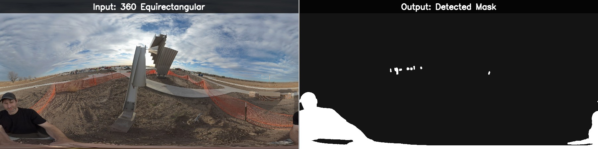

# Reconstruction Zone




> Photogrammetry preprocessing toolkit — extract frames from video, reframe 360° and fisheye into perspective views, auto-mask unwanted objects, and build clean datasets for 3D reconstruction.

This GUI prepares camera captures for 3D reconstruction. Extract and reframe perspectives from 360° or fisheye video, filter for sharpness, auto-detect and mask photographers/tripods/equipment across hundreds of images, review every mask with an interactive editor, then analyze spatial coverage and fill gaps. Outputs datasets ready for reconstruction pipelines.

<details>
<summary><strong>Installation</strong></summary>

```bash
# PyTorch with CUDA (recommended — CPU works but is 10-50x slower)
pip install torch torchvision torchaudio --index-url https://download.pytorch.org/whl/cu126

# Core dependencies
pip install numpy opencv-python ultralytics tqdm pyyaml

# GUI
pip install customtkinter
```

**Also needed:** [ffmpeg + ffprobe](https://ffmpeg.org/download.html) on PATH (for video extraction features).

</details>

## Launch

Double-click `reconstruction_gui/ReconstructionStudio.bat` to start the app (no console window).

Or from the command line:

```bash
python reconstruction_gui/reconstruction_zone.py
```

## The four tabs

The GUI is organized into four tabs that follow the photogrammetry preprocessing workflow:

| Tab | What it does | Guide |
|-----|-------------|-------|
| **Extract** | Pull frames from 360° video, fisheye, or standard video. Equirect-to-perspective reframing with configurable view rings. | [Extract Guide](reconstruction_gui/docs/EXTRACT_TAB.md) |
| **Mask** | Auto-detect and mask objects using text prompts or class selection. Supports 360°-aware cubemap decomposition. | [Mask Guide](reconstruction_gui/docs/MASK_TAB.md) |
| **Review** | Thumbnail grid with accept/reject/skip workflow. Open any mask in the interactive editor for brush, flood fill, and lasso touch-ups. | [Review Guide](reconstruction_gui/docs/REVIEW_TAB.md) |
| **Coverage** | Analyze spatial coverage gaps in your dataset and extract bridge frames to fill them. | [Coverage Guide](reconstruction_gui/docs/COVERAGE_TAB.md) |

<details>
<summary><strong>Supported models</strong></summary>

| Model | Type | Speed | Best for |
|-------|------|-------|----------|
| **SAM 3** | Text-prompted | ~300ms/img | Highest quality, arbitrary objects ("selfie stick", "tripod") |
| **YOLO26** | Class-based | ~15ms/img | Fast batch processing, COCO objects (person, backpack, car) |
| **RF-DETR** | Transformer | ~50ms/img | Strong detection + segmentation in one pass |
| **FastSAM** | Real-time SAM | ~30ms/img | Quick previews, lightweight |
| **EfficientSAM** | Lightweight SAM | ~40ms/img | Fallback when others unavailable |

Models auto-download on first use. See the full [Model Guide](reconstruction_gui/docs/MODELS.md) for configuration, model sizes, and comparison.

</details>

## Requirements

- Python 3.10+ (tested on 3.12–3.14)
- NVIDIA GPU with CUDA (strongly recommended)
- ffmpeg + ffprobe on PATH (for video features)

## Documentation

- [Quickstart](reconstruction_gui/docs/QUICKSTART.md) — First mask in 5 minutes
- [Architecture](reconstruction_gui/docs/ARCHITECTURE.md) — Pipeline internals, data flow, module map
- [Model Guide](reconstruction_gui/docs/MODELS.md) — Model comparison, configuration, COCO class reference
- [Contributing](reconstruction_gui/docs/CONTRIBUTING.md) — Adding new models and modules

## License

This project is licensed under the [GNU General Public License v3.0](LICENSE).
