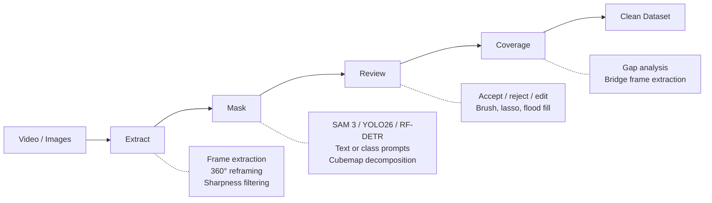

# README Visual Improvements — Working Document

Tracking ideas for making the README more accessible and visually compelling.

## 1. Badges

Add under the `# Reconstruction Zone` heading, before the hero image.

```markdown


```

**Status:** Done — added to README.

---

## 2. Mermaid Workflow Diagram

Paste directly into README as a fenced `mermaid` code block. GitHub renders natively.

**Test locally:** Paste the mermaid code (without backticks) into [mermaid.live](https://mermaid.live) to preview and tweak.

**Draft:**



**Status:** Draft ready. Test on mermaid.live, refine layout/wording, then add to README.

---

## 3. Collapsible Installation

Wrap the install block in a `<details>` tag so it doesn't dominate the page.

```markdown
<details>
<summary><strong>Installation</strong></summary>

... install instructions here ...

</details>
```

**Status:** Done — added to README.

---

## 4. Annotated Tab Screenshots

Plain screenshots of the GUI are bland. Annotated versions with callout labels showing key UI regions are far more useful.

**Approach:**
- Take screenshots of each tab with real data loaded
- Annotate in Illustrator (or similar) with numbered callouts / arrows
- Save to `reconstruction_gui/docs/assets/` as PNGs
- Reference from README, possibly in a collapsible section per tab

### Extract Tab
- [ ] Source selection panel (video file / image folder / fisheye toggle)
- [ ] Frame interval and extraction settings
- [ ] 360° reframe ring configuration (pitch, count, FOV sliders)
- [ ] Extraction queue with progress
- [ ] Preview of extracted frames

### Mask Tab
- [ ] Model selector dropdown (SAM3 / YOLO26 / RF-DETR / FastSAM)
- [ ] Text prompt input (SAM3 mode)
- [ ] Class selection checkboxes (YOLO mode)
- [ ] Detection overlay on source image
- [ ] Mask preview (binary mask output)
- [ ] Cubemap decomposition for 360° images (6-face breakdown)
- [ ] Batch processing progress

### Review Tab
- [ ] Thumbnail grid with accept/reject/skip status indicators
- [ ] Side-by-side original + mask overlay view
- [ ] Interactive mask editor (brush, flood fill, lasso tools)
- [ ] Toolbar with tool options (brush size, fill tolerance)
- [ ] Zoom/pan controls

### Coverage Tab
- [ ] Spatial gap visualization (map/heatmap of coverage)
- [ ] Gap list with severity indicators
- [ ] Bridge frame extraction controls
- [ ] Before/after coverage comparison

**Status:** Needs manual capture and annotation.

---

## 5. Before/After Gallery

A small grid showing the tool's range — different camera types, masking scenarios, and edge cases.

**Format:** Side-by-side pairs (original | masked), or a 2-column grid. Each pair should have a short caption.

### Camera Types
- [ ] 360° equirect — full spherical panorama
- [ ] Dual fisheye — raw dual-circle image
- [ ] Standard perspective — normal photo/video frame
- [ ] Cubemap faces — single equirect shown as 6 reframed perspectives

### Masking Scenarios
- [ ] Photographer + tripod in 360° image (the classic use case)
- [ ] Selfie stick at nadir (bottom of sphere)
- [ ] Person with backpack in perspective shot
- [ ] Photographer in fisheye overlap zone
- [ ] Multiple people in scene (selective masking)
- [ ] Photographer shadow on ground
- [ ] Equipment reflection in windows/surfaces

### Edge Cases / Impressive Results
- [ ] Heavily occluded subject (partially behind object)
- [ ] Subject near image edge / wraparound boundary in equirect
- [ ] Very small subject in wide-angle shot
- [ ] Complex scene with many potential detections, only target masked
- [ ] Before/after of mask editor touch-up (raw auto-mask → cleaned mask)

### Pipeline Stages
- [ ] Raw frame → extracted perspectives (reframe step)
- [ ] Perspective → auto-detected mask (segmentation step)
- [ ] Auto mask → reviewed/edited mask (review step)
- [ ] Full equirect with mask overlay showing all detections

**Status:** Needs sample images. Pick scenarios where you have real data.

---

## 6. Animated GIF / Short Clips

Short, silent screen recordings showing the tool in action. GitHub auto-loops GIFs inline. Can also use MP4 embedded via `<video>` tag for better quality/smaller file size.

**Recording tools:** OBS or ShareX (both free, Windows). Record a screen region, export as GIF or MP4.

### Top Candidates

**A. Review workflow** (~15s) — *Best bang for buck*
- Click through thumbnail grid, accept a few, reject one, open editor
- Quick brush fix on a mask, save, back to grid
- Shows the core quality-control loop

**B. Mask tab in action** (~20s)
- Type a text prompt ("photographer with tripod"), hit detect
- Watch detections appear on the image
- Toggle mask overlay on/off
- Shows the AI-powered core feature

**C. Full pipeline walkthrough** (~45s)
- Extract tab: load video, configure, extract frames
- Mask tab: select model, run batch
- Review tab: scan results, fix one
- Coverage tab: check gaps
- Shows the complete workflow end-to-end

**D. 360° cubemap decomposition** (~15s)
- Load an equirectangular image
- Watch it decompose into 6 cubemap faces
- See per-face detection + merged result
- Unique selling point — most tools can't do this

**E. Mask editor deep dive** (~20s)
- Open a mask with issues
- Use brush to add missed area
- Use flood fill to clean interior
- Use lasso to remove false positive region
- Shows the precision editing tools

**F. Batch processing** (~10s, could be sped up)
- Start a batch of 50+ images
- Progress bar advancing, thumbnails populating
- Shows it handles real workloads

### Priority
1. **B** (Mask tab) or **A** (Review) — one of these as the hero GIF in the README
2. **D** (Cubemap) — unique differentiator, great for "how is this different" question
3. **C** (Full pipeline) — good for docs/wiki, maybe too long for README

**Status:** Low priority. Do after screenshots and before/after gallery.

---

## Priority Order

1. **Badges** — 2 minutes, ready now
2. **Collapsible install** — 2 minutes, ready now
3. **Mermaid diagram** — 10 minutes, test on mermaid.live first
4. **Annotated screenshots** — needs manual capture + annotation
5. **Before/after gallery** — needs sample images
6. **Animated GIF** — needs screen recording
