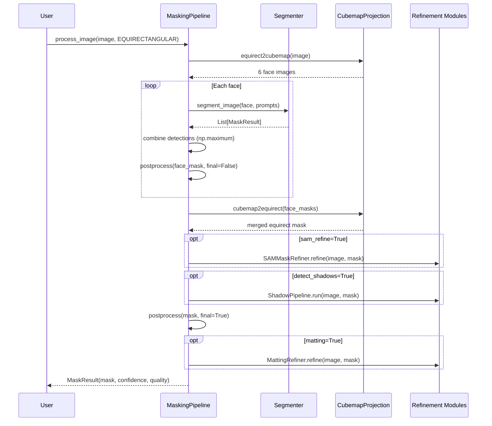

# Architecture

A deep dive into how the masking pipeline works, why it's designed this way, and where to find things in the code.

## System layers

```
┌─────────────────────────────────────────────────────────────────┐
│  GUI Layer                                                       │
│  reconstruction_zone.py + tabs/ + widgets.py + app_infra.py           │
│  CustomTkinter app, 4 tabs, threading, preview, review grid      │
├─────────────────────────────────────────────────────────────────┤
│  Pipeline Layer                                                   │
│  reconstruction_pipeline.py — MaskingPipeline orchestrator                     │
│  ┌──────────┐ ┌──────────┐ ┌──────────┐ ┌──────────┐            │
│  │ SAM3     │ │ YOLO26   │ │ RF-DETR  │ │ FastSAM  │  Segmenters│
│  └──────────┘ └──────────┘ └──────────┘ └──────────┘            │
│  ┌──────────────────────────────────────────────────┐            │
│  │ CubemapProjection · TemporalConsistency          │  Geometry  │
│  └──────────────────────────────────────────────────┘            │
├─────────────────────────────────────────────────────────────────┤
│  Refinement Modules (optional, lazy-loaded)                       │
│  sam_refinement.py · matting.py · vos_propagation.py              │
│  shadow_detection.py · colmap_validation.py · sam3_pipeline.py    │
├─────────────────────────────────────────────────────────────────┤
│  Review / QC Layer                                                │
│  review_gui.py · review_status.py · review_masks.py              │
└─────────────────────────────────────────────────────────────────┘
```

**Key constraint:** The pipeline layer has zero GUI dependencies. Every feature works via Python API or could be wrapped in a CLI. The GUI is a thin orchestration layer that builds `MaskConfig`, calls pipeline methods in background threads, and displays results.

## Module map

| File | Lines | Key classes | Purpose |
|------|-------|-------------|---------|
| `reconstruction_pipeline.py` | ~1500 | `MaskingPipeline`, `MaskConfig`, `MaskResult`, `BaseSegmenter`, `CubemapProjection`, `TemporalConsistency` | Core pipeline — segmentation, cubemap geometry, postprocessing, batch processing |
| `reconstruction_zone.py` | ~3400 | `ReconstructionZone` | GUI app — 4 tabs (Extract, Mask, Review, Coverage), preview panel, mask/review integration |
| `sam3_pipeline.py` | ~500 | `SAM3VideoPipeline`, `SAM3VideoConfig` | SAM 3 video predictor for unified detect+track across frames |
| `sam_refinement.py` | ~550 | `SAMMaskRefiner`, `SAMRefinementConfig`, `SAMWeightManager` | Boundary refinement using SAM point/box prompts from coarse masks |
| `matting.py` | ~300 | `MattingRefiner`, `MattingConfig` | Binary mask → soft alpha matte via [ViTMatte](https://github.com/hustvl/ViTMatte) |
| `vos_propagation.py` | ~450 | `VOSPropagator`, `VOSConfig` | Temporal propagation via [LiVOS](https://github.com/hkchengrex/LiVOS) or [Cutie](https://github.com/hkchengrex/Cutie) |
| `shadow_detection.py` | ~950 | `ShadowPipeline`, `ShadowConfig` | Multi-method shadow detection (brightness, chromaticity, deep learning) |
| `colmap_validation.py` | ~700 | `GeometricValidator`, `ValidationConfig` | Validate mask consistency against COLMAP 3D reconstruction |
| `review_gui.py` | ~600 | `ThumbnailWidget`, `load_overlay_thumbnail` | Review app + reusable overlay/thumbnail functions |
| `review_status.py` | ~150 | `ReviewStatusManager`, `MaskStatus` | Persistent review state (accept/reject/edit) per mask |
| `review_masks.py` | ~800 | — | Interactive OpenCV mask editor (brush, flood fill, lasso, zoom/pan) |
| `app_infra.py` | ~200 | `AppInfrastructure` | GUI mixin: logging, threading, preferences, file dialogs |
| `widgets.py` | ~150 | `Section`, `CollapsibleSection`, `slider_row` | Shared UI building blocks |
| `tabs/source_tab.py` | ~1800 | — | Extract tab: video analysis, extraction queue, fisheye |
| `tabs/gaps_tab.py` | ~500 | — | Coverage tab: spatial gap detection, bridge extraction |

## The equirectangular problem

Standard object detectors (YOLO, SAM, etc.) are trained on perspective images. When you feed them a 360° equirectangular image, they fail at the poles — a person standing near the zenith or nadir gets stretched to absurd proportions, and the detector either misses them or produces garbage masks.

```
Equirectangular projection stretches objects at poles:

  ━━━━━━━━━━━━━━━━━━━━━━━━━━━━━━━━━  ← Zenith: extreme stretch
  ▓▓▓▓▓▓▓▓▓▓▓▓▓▓▓▓▓▓▓▓▓▓▓▓▓▓▓▓▓▓▓    A person here is 5x wider
  ░░░░░░░░░░░░░░░░░░░░░░░░░░░░░░░░░
  ░░░░░░░░░░░░░░░░░░░░░░░░░░░░░░░░░  ← Equator: normal proportions
  ░░░░░░░░░░░░░░░░░░░░░░░░░░░░░░░░░
  ▓▓▓▓▓▓▓▓▓▓▓▓▓▓▓▓▓▓▓▓▓▓▓▓▓▓▓▓▓▓▓    Tripod here is a distorted blob
  ━━━━━━━━━━━━━━━━━━━━━━━━━━━━━━━━━  ← Nadir: extreme stretch
```

### Solution: cubemap decomposition

`CubemapProjection` (line 1120 of reconstruction_pipeline.py) converts the equirectangular image to 6 perspective cubemap faces, each with a standard 90° field of view. Every face looks like a normal photo — detectors work correctly.

```
                    ┌────────┐
                    │   Up   │
               ┌────┼────────┼────┬────────┐
               │Left│  Front │Right│  Back  │
               └────┼────────┼────┴────────┘
                    │  Down  │
                    └────────┘

Each face: 1024×1024 pixels, 90° FOV (perspective projection)
```

**Face overlap:** With exactly 90° FOV, an object sitting right at a face boundary might be split and detected by neither face. Setting `cubemap_overlap=2.0` (degrees) expands each face's FOV to 92°, creating a thin overlap zone where both adjacent faces see the same content. In overlap regions, the pipeline takes the union of detections.

The math is in `CubemapProjection.__init__`:
```python
half_fov = (90.0 + overlap_degrees) / 2.0
self._grid_extent = np.tan(np.radians(half_fov))  # 1.0 at 90°, ~1.035 at 92°
```

### Two-stage postprocessing

This is a critical design choice. Postprocessing runs twice with different parameters:

**Stage 1 — Per-face (`final=False`):**
After each face is segmented, lightweight cleanup: morphological open (3×3) to remove noise, close (5×5) to smooth edges, remove tiny connected components. No dilation, no fill-holes — at 1024px face resolution, these would be either useless (gaps too small) or destructive (filling legitimate gaps).

**Stage 2 — Full resolution (`final=True`):**
After all faces are merged back to equirect (e.g., 7680×3840), the heavy operations run:

1. **Pole mask expansion** — Dilate masks in the top/bottom 10% of the image (compensating for pole distortion remaining from imperfect cubemap→equirect reprojection)
2. **Dilation** — Grow mask outward by `mask_dilate_px` pixels (elliptic kernel)
3. **Fill holes** — The signature algorithm:
   - Morphological close with a kernel ~0.4% of image width (~31px at 7680w). This bridges narrow channels between interior holes and the exterior.
   - Flood-fill from the image border. Everything reachable from the border is "exterior." Everything not reached is an interior hole.
   - Union the holes back into the mask.
4. **Nadir auto-mask** — Optionally mask the bottom N% (tripod/nadir cap area)
5. **Final cleanup** — Open 3×3, close 5×5, remove tiny components

**Why flood-fill instead of contour hierarchy?** Contour hierarchy (`cv2.RETR_CCOMP`) detects holes as inner contours. But it can't fill holes connected to the exterior through narrow channels — a common case when the mask covers a person's arm with a thin gap to the body. The morphological close bridges those channels first, making flood-fill correct.

## Pipeline execution flow



## Segmenter abstraction

All segmentation models implement `BaseSegmenter` (line 379):

```python
class BaseSegmenter(ABC):
    def __init__(self, config: MaskConfig):
        self.config = config
        self.device = config.device
        self.model = None

    @abstractmethod
    def initialize(self):
        """Load model weights onto device."""

    @abstractmethod
    def segment_image(self, image, prompts=None) -> List[MaskResult]:
        """Run detection + segmentation. Return one MaskResult per detection."""

    def preprocess_image(self, image, geometry) -> np.ndarray:
        """Geometry-specific preprocessing (CLAHE for equirect poles, radial for fisheye)."""

    def postprocess_mask(self, mask, geometry, final=False) -> np.ndarray:
        """Morphological cleanup + optional dilation/fill-holes (when final=True)."""

    def _evaluate_mask_quality(self, mask, confidence) -> MaskQuality:
        """Composite score: 50% confidence + 20% edge coherence + 30% compactness."""
```

The factory in `MaskingPipeline.__init__` selects the right subclass based on `config.model` and calls `initialize()`. If the preferred model fails to import, auto-fallback tries the next in the chain: SAM3 → RF-DETR → YOLO26 → FastSAM → EfficientSAM → SAM2.

See [CONTRIBUTING.md](CONTRIBUTING.md) for how to add a new segmenter.

## Temporal propagation

For video sequences (ordered frames), you have two temporal strategies:

### Sliding-window averaging (built-in)

`TemporalConsistency` (line 1064) maintains a deque of recent masks and returns a weighted average. Simple, fast, no extra dependencies. Enabled by default when `use_temporal_consistency=True`.

### VOS propagation (optional, superior)

`VOSPropagator` wraps [LiVOS](https://github.com/hkchengrex/LiVOS) (CVPR 2025) or [Cutie](https://github.com/hkchengrex/Cutie) (CVPR 2024) for real video object segmentation. Instead of averaging, it actually tracks objects across frames:

1. **Keyframes** (every `vos_keyframe_interval` frames): Run full detection, feed both the image and detected mask to VOS as a reference.
2. **Intermediate frames**: Feed only the image. VOS propagates the mask from the nearest keyframe using learned appearance/motion models.
3. **Bidirectional option**: Process forward, then backward, then merge.

This produces dramatically more consistent masks than averaging — objects are tracked through occlusion, scale changes, and motion blur.

## Shadow detection

`shadow_detection.py` implements multiple shadow detection algorithms, selectable via `ShadowConfig.detector_type`:

| Algorithm | Key | How it works | Paper/Source |
|-----------|-----|-------------|--------------|
| `brightness` | Heuristic | Relative darkness ratio below person mask base. Fast, no model. | — |
| `c1c2c3` | Physical | Chromaticity-invariant color space (c1, c2, c3). Shadows change brightness but not chrominance. | Gevers & Smeulders, 1999 |
| `hybrid` | Combined | Brightness + C1C2C3 fusion | — |
| `sddnet` | Deep learning | SDDNet shadow detection network | [Zhu et al.](https://github.com/rmcong/SDDNet-TGRS2022) |
| `careaga` | Illuminant | Illumination estimation + shadow boundary detection | [Careaga & Aksoy](https://github.com/stevleiux/shadow-removal) |

The default `brightness` heuristic works well for outdoor photogrammetry (strong directional light, dark ground shadows). For complex indoor scenes, `hybrid` or `sddnet` give better results.

**Spatial filtering** (`ShadowConfig.spatial_mode`):
- `all` — Keep all detected shadows
- `near_objects` — Only keep shadows spatially connected to detected object masks
- `connected` — Only keep shadow regions directly adjacent to mask boundaries

## COLMAP validation

`GeometricValidator` in `colmap_validation.py` validates mask consistency against an existing COLMAP sparse reconstruction. This is a post-reconstruction quality check:

1. Parse COLMAP binary/text model (cameras, images, points3D)
2. For each 3D point, project it into every camera view that observes it
3. Check whether the 2D projection falls inside or outside the mask in each view
4. A consistent 3D point should be either always-masked or always-unmasked across views
5. Report per-frame consistency scores; flag frames below threshold

This catches masks that are inconsistent across views — e.g., a tripod masked in some frames but not others, which would create artifacts in the reconstruction.

## Quality scoring

`_evaluate_mask_quality()` computes a weighted composite of three metrics:

| Metric | Weight | What it measures | Why it matters |
|--------|--------|-----------------|----------------|
| **Confidence** | 50% | Raw detection model confidence | Direct indicator of detection reliability |
| **Edge coherence** | 20% | Canny edge count relative to mask perimeter | Smooth, consistent edges = correct segmentation. Jagged/noisy edges = poor mask |
| **Compactness** | 30% | Isoperimetric ratio: `4π × area / perimeter²` | Regular shapes (person, backpack) score high. Fragmented/spindly shapes score low |

**Hard rejection gates** (bypass scoring entirely):
- Mask smaller than `min_mask_area` pixels → `REJECT`
- Mask larger than `max_mask_area_ratio` × image area → `REJECT`

**Quality thresholds:**

| Score range | Quality level | Action |
|-------------|--------------|--------|
| ≥ 0.85 | `EXCELLENT` | Auto-accept |
| ≥ 0.70 | `GOOD` | Auto-accept |
| ≥ 0.55 | `REVIEW` | Flagged for human review |
| ≥ 0.35 | `POOR` | Flagged, likely needs manual editing |
| < 0.35 | `REJECT` | Discarded |

## GUI architecture

The GUI (`reconstruction_zone.py`) inherits from both `AppInfrastructure` (logging/threading mixin) and `ctk.CTk` (CustomTkinter window).

### Layout

```
┌──────────────────────────────────────────────────────────────┐
│  ReconstructionZone                                           │
│  ┌──────────────────────┬───────────────────────────────────┐ │
│  │  Tab View (35%)       │  Preview Panel (65%)              │ │
│  │  ┌─────────────────┐ │  ┌─────────────────────────────┐ │ │
│  │  │ Extract         │ │  │ Image overlay / mask view    │ │ │
│  │  │ Mask            │ │  │                             │ │ │
│  │  │ Review          │ │  │                             │ │ │
│  │  │ Coverage        │ │  ├─────────────────────────────┤ │ │
│  │  └─────────────────┘ │  │ Navigator slider            │ │ │
│  │                       │  │ Zoom slider                 │ │ │
│  │  [Config widgets      │  │ Console log                 │ │ │
│  │   for active tab]     │  └─────────────────────────────┘ │ │
│  └──────────────────────┴───────────────────────────────────┘ │
└──────────────────────────────────────────────────────────────┘
```

### Threading model

All heavy operations (segmentation, batch processing, preview) run in daemon threads. The pattern:

```python
def _start_operation(self, target, *args):
    self.cancel_flag.clear()
    thread = threading.Thread(target=target, args=args, daemon=True)
    thread.start()

def _worker(self):
    for image_path in images:
        if self.cancel_flag.is_set():
            break
        result = self.pipeline.process_image(...)
        self.after(0, self._update_ui, result)  # thread-safe UI update
```

- `cancel_flag` (`threading.Event`) — checked in loops for user cancellation
- `log_queue` (`queue.Queue`) — all log messages go here; polled by `_poll_log_queue()` every 100ms via `after()`
- `stdout`/`stderr` redirected to `log_queue` — captures print output from pipeline modules
- UI updates via `self.after(0, callback)` — schedules callback on tkinter's main thread

### Preferences persistence

`.studio_prefs.json` stores last-used directories, prompt lists, shadow settings, preview state. Loaded at startup, saved on change. Located in the `reconstruction_gui/` directory.

## MaskConfig reference

Complete field listing for the `MaskConfig` dataclass:

### Core detection

| Field | Type | Default | Description |
|-------|------|---------|-------------|
| `model` | `SegmentationModel` | `SAM3` | Primary segmentation model |
| `model_checkpoint` | `str\|None` | `None` | Override model weight path |
| `device` | `str` | auto | `cuda` if available, else `cpu` |
| `remove_prompts` | `List[str]` | `["person","tripod","backpack","selfie stick"]` | SAM 3 text prompts |
| `keep_prompts` | `List[str]` | `[]` | SAM 3 "protect these objects" prompts |
| `yolo_model_size` | `str` | `"n"` | YOLO model variant: n/s/m/l/x |
| `yolo_classes` | `List[int]` | `[0,24,25,26,28]` | COCO class IDs for YOLO/RF-DETR |
| `confidence_threshold` | `float` | `0.70` | Detection confidence cutoff |
| `review_threshold` | `float` | `0.85` | Below this → flagged for review |
| `min_mask_area` | `int` | `100` | Reject masks smaller than this (pixels) |
| `max_mask_area_ratio` | `float` | `0.5` | Reject masks larger than 50% of image |

### Geometry & 360° handling

| Field | Type | Default | Description |
|-------|------|---------|-------------|
| `geometry_aware` | `bool` | `True` | Enable cubemap decomposition for equirect |
| `handle_distortion` | `bool` | `True` | CLAHE for poles, radial for fisheye |
| `cubemap_overlap` | `float` | `0.0` | Degrees of face overlap (0–30) |
| `pole_mask_expand` | `float` | `1.2` | Dilation factor at equirect poles |
| `nadir_mask_percent` | `float` | `0.0` | Auto-mask bottom N% of equirect |

### Postprocessing

| Field | Type | Default | Description |
|-------|------|---------|-------------|
| `mask_dilate_px` | `int` | `0` | Dilate final mask by N pixels |
| `fill_holes` | `bool` | `False` | Fill enclosed interior holes |
| `detect_shadows` | `bool` | `False` | Extend masks to cover shadows |
| `shadow_config` | `dict\|None` | `None` | ShadowConfig parameters |
| `edge_injection` | `bool` | `False` | Canny edge recovery for thin structures |
| `edge_canny_low` | `int` | `50` | Canny lower threshold |
| `edge_canny_high` | `int` | `150` | Canny upper threshold |
| `edge_dilate_px` | `int` | `2` | Dilate injected edges |

### Refinement modules

| Field | Type | Default | Description |
|-------|------|---------|-------------|
| `sam_refine` | `bool` | `False` | [SAM](https://segment-anything.com/) boundary refinement |
| `sam_refine_config` | `dict\|None` | `None` | SAMRefinementConfig parameters |
| `matting` | `bool` | `False` | [ViTMatte](https://github.com/hustvl/ViTMatte) alpha matting |
| `matting_config` | `dict\|None` | `None` | MattingConfig parameters |
| `vos_propagation` | `bool` | `False` | [LiVOS](https://github.com/hkchengrex/LiVOS)/[Cutie](https://github.com/hkchengrex/Cutie) temporal propagation |
| `vos_config` | `dict\|None` | `None` | VOSConfig parameters |
| `vos_keyframe_interval` | `int` | `5` | Detect every N frames |

### Ensemble

| Field | Type | Default | Description |
|-------|------|---------|-------------|
| `ensemble` | `bool` | `False` | Multi-model weighted fusion |
| `ensemble_models` | `List[str]` | `["yolo26","rfdetr"]` | Models to ensemble |
| `ensemble_weights` | `List[float]\|None` | `None` | Per-model weights (None = equal) |
| `ensemble_iou_threshold` | `float` | `0.5` | IoU for mask cluster matching |

### Advanced

| Field | Type | Default | Description |
|-------|------|---------|-------------|
| `rfdetr_model_size` | `str` | `"small"` | RF-DETR size: nano/small/medium/large |
| `sam3_unified` | `bool` | `False` | SAM 3 video predictor for directories |
| `colmap_validate` | `bool` | `False` | COLMAP geometric validation |
| `colmap_dir` | `str` | `""` | Path to COLMAP sparse reconstruction |
| `multi_label` | `bool` | `False` | Per-class segmentation map output |
| `inpaint_masked` | `bool` | `False` | Inpaint masked regions |
| `torch_compile` | `bool` | `False` | torch.compile() for faster inference |
| `batch_size` | `int` | `4` | Processing batch size |
| `num_workers` | `int` | `4` | ThreadPoolExecutor workers |

### Output

| Field | Type | Default | Description |
|-------|------|---------|-------------|
| `save_confidence_maps` | `bool` | `False` | Save raw confidence maps |
| `save_review_images` | `bool` | `True` | Save overlays for flagged masks |
| `output_format` | `str` | `"png"` | `"png"`, `"jpg"`, or `"npy"` |
